# 🦓 Zebra — Architecture Diagrams
### All 12 Modules: Use Case + System Sequence Diagrams

> ⚠️ **Superseded (2026-06-11 pivot).** These diagrams describe the v1 Flutter + on-device-SLM ("Edge AI") architecture, which has been scrapped. The current direction is a web-first Next.js + Supabase + Capacitor stack with creation-time cloud AI behind a moderation/approval gate — see [docs/plan/03-tech-stack.md](../plan/03-tech-stack.md). The module breakdown (IAM, curation, safety, sync, compliance…) remains a useful functional reference; the Edge-SLM/self-hosted-GPU deployment model does not. Edge/on-device inference is retained only as a possible future cost optimization.

> **Legend**  
> 🟦 **Edge AI (On-Device SLM)** — runs locally on the user's device, no cloud required  
> 🟧 **Cloud GPU** — self-hosted inference server for heavy generative workloads  
> 🟩 **System / Backend** — application services, databases, APIs  

---

## MODULE 1 — Identity, Access Management (IAM) & Role-Based Security

### 1.1 Use Case Diagram

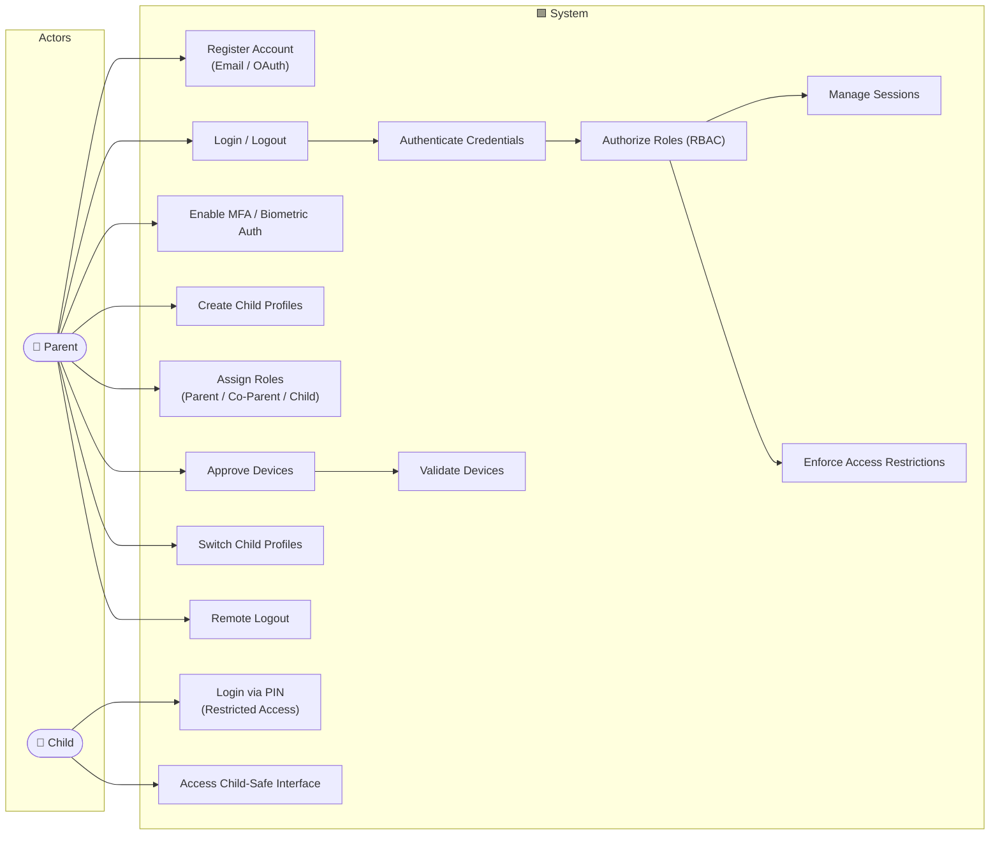

### 1.2 System Sequence Diagram

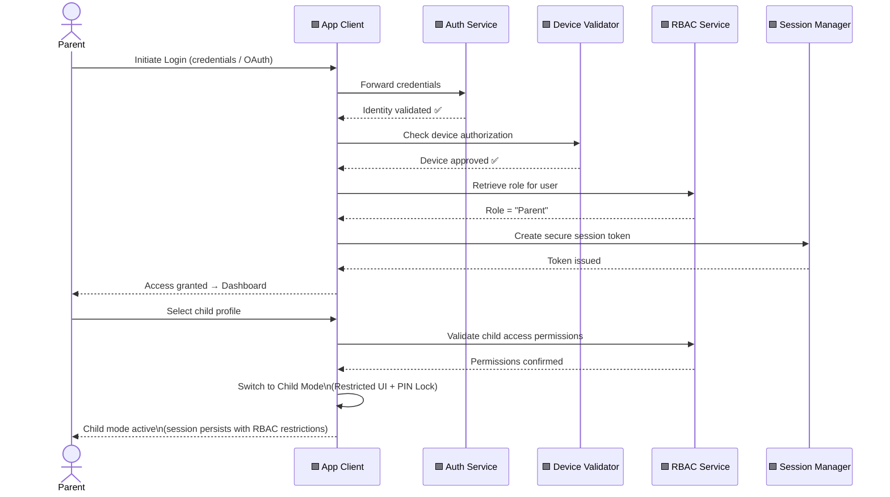

---

## MODULE 2 — Parent Dashboard & Content Curation

### 2.1 Use Case Diagram

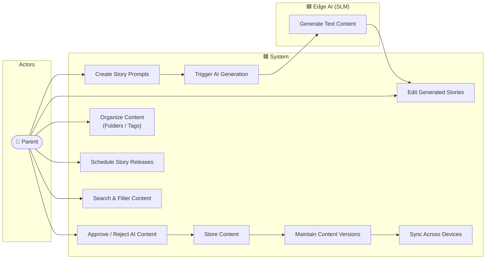

### 2.2 System Sequence Diagram

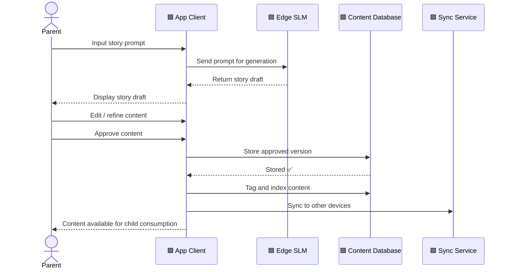

---

## MODULE 3 — Edge AI Text & NLP Engine (On-Device)

### 3.1 Use Case Diagram

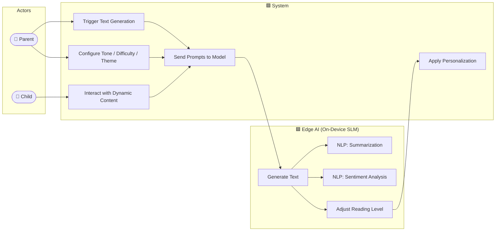

### 3.2 System Sequence Diagram

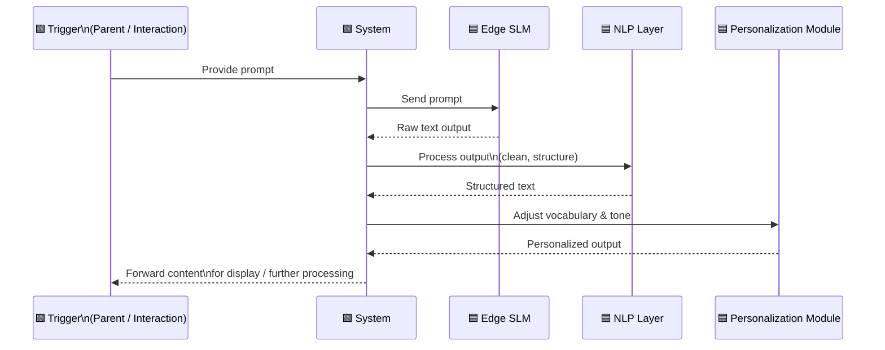

---

## MODULE 4 — Self-Hosted Media Generation Engine (Cloud GPU)

### 4.1 Use Case Diagram

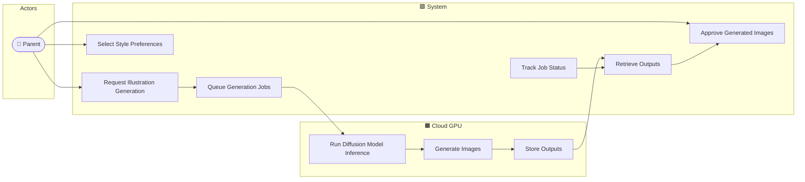

### 4.2 System Sequence Diagram

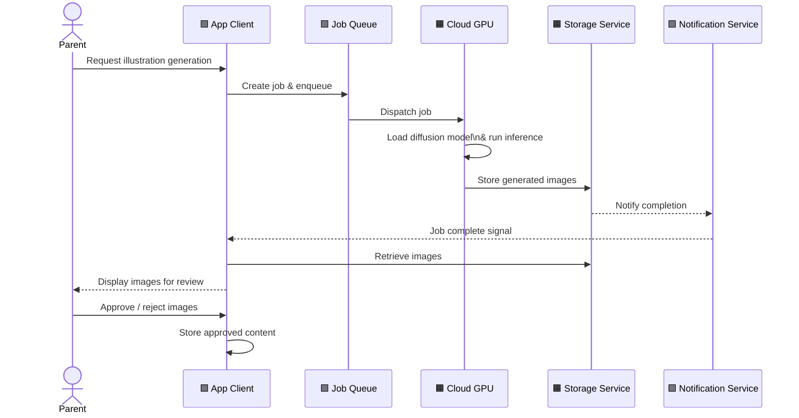

---

## MODULE 5 — Safety, Guardrails & Real-Time Monitoring

### 5.1 Use Case Diagram

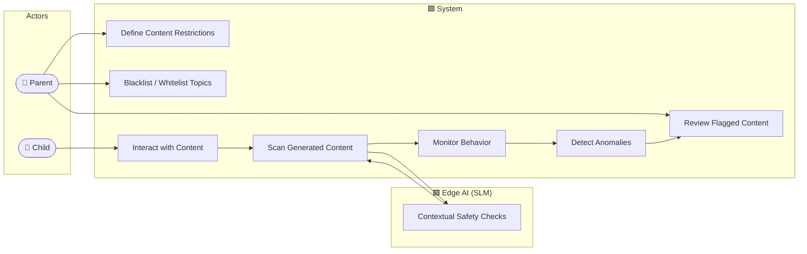

### 5.2 System Sequence Diagram

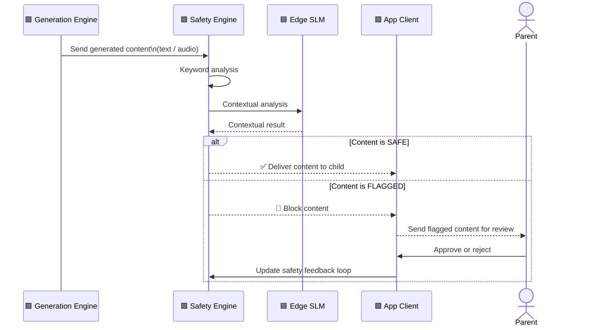

---

## MODULE 6 — Child UX (Playback, Interaction, Accessibility)

### 6.1 Use Case Diagram

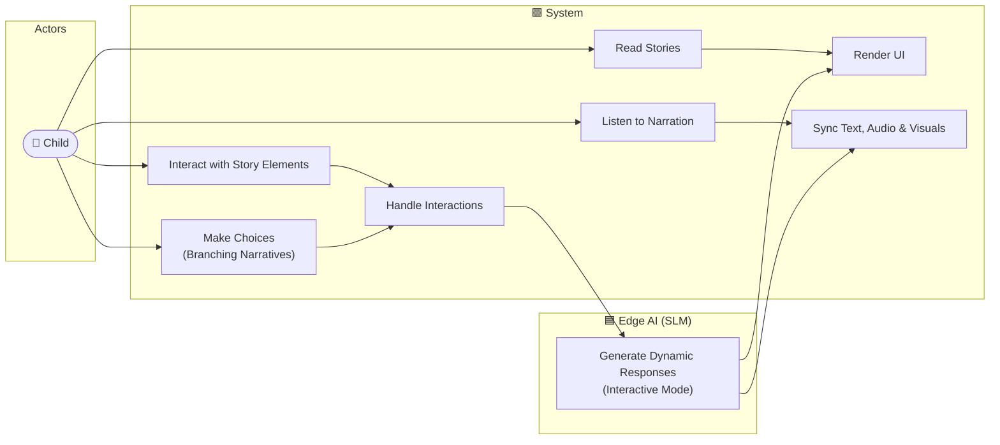

### 6.2 System Sequence Diagram

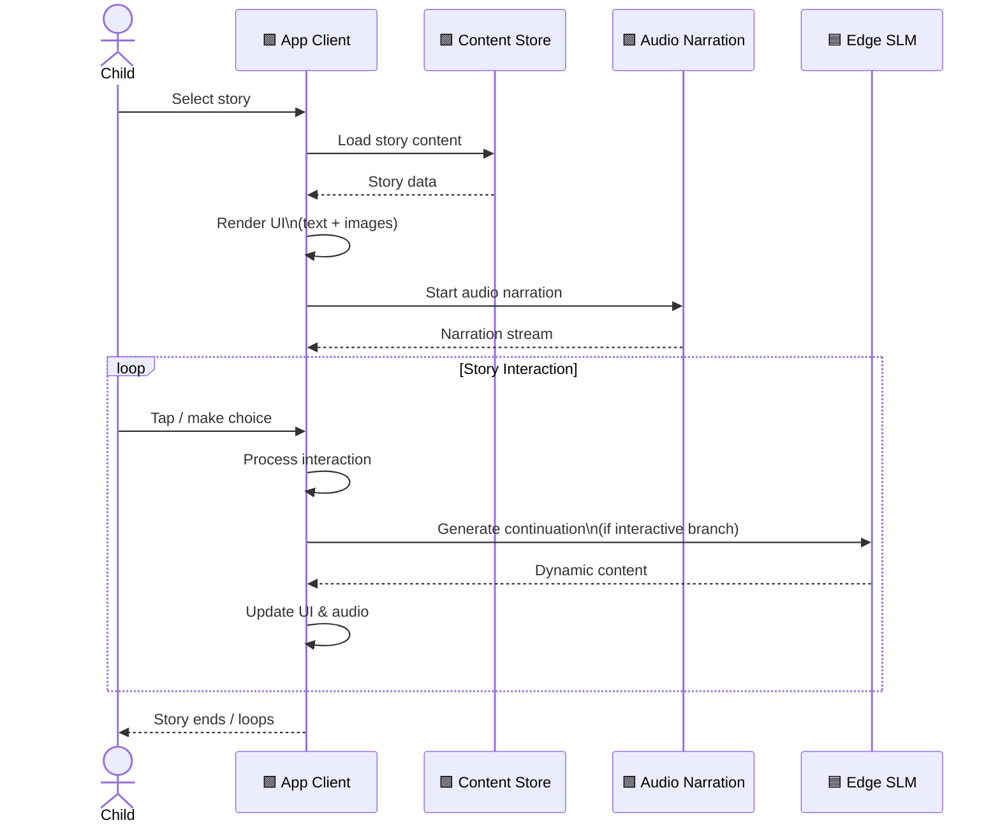

---

## MODULE 7 — Data Synchronization & Offline Functionality

### 7.1 Use Case Diagram

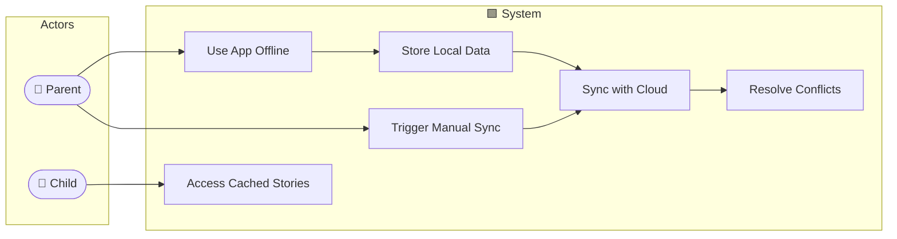

### 7.2 System Sequence Diagram

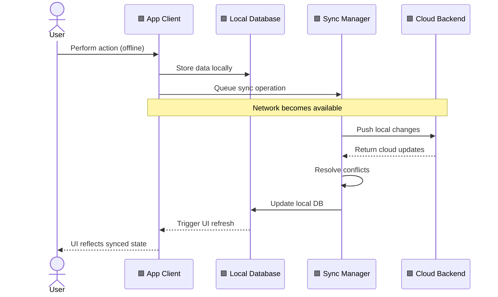

---

## MODULE 8 — Analytics, Activity Tracking & Screen Time

### 8.1 Use Case Diagram

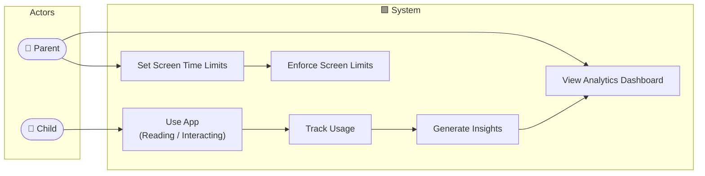

### 8.2 System Sequence Diagram

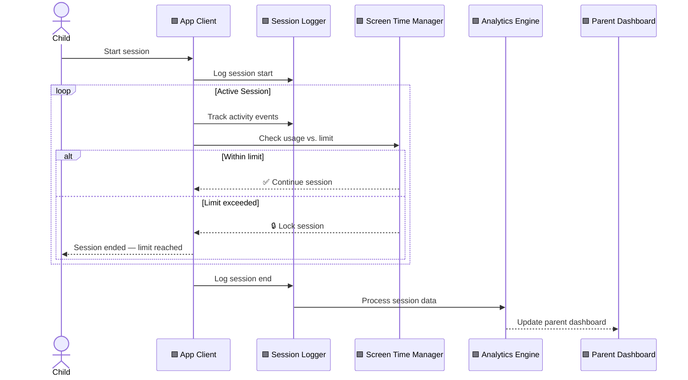

---

## MODULE 9 — Cross-Platform Technical & Performance

### 9.1 Use Case Diagram

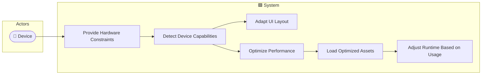

### 9.2 System Sequence Diagram

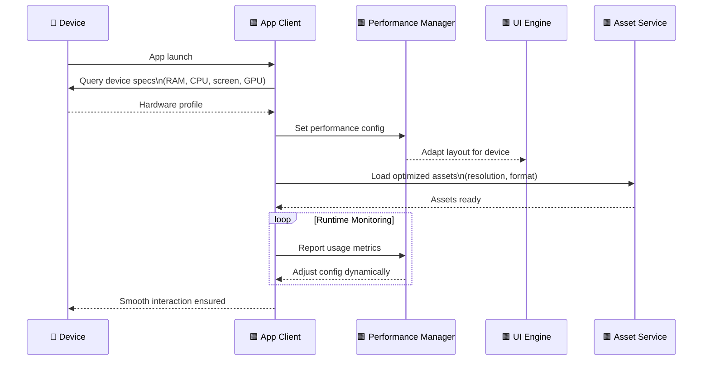

---

## MODULE 10 — Monetization & Subscription Management

### 10.1 Use Case Diagram

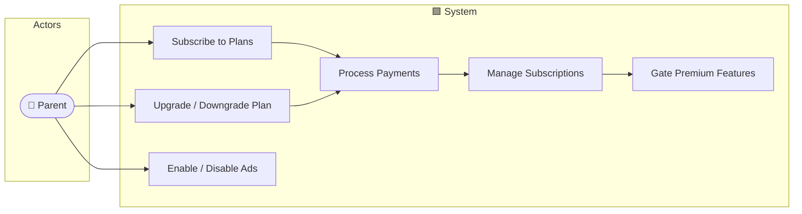

### 10.2 System Sequence Diagram

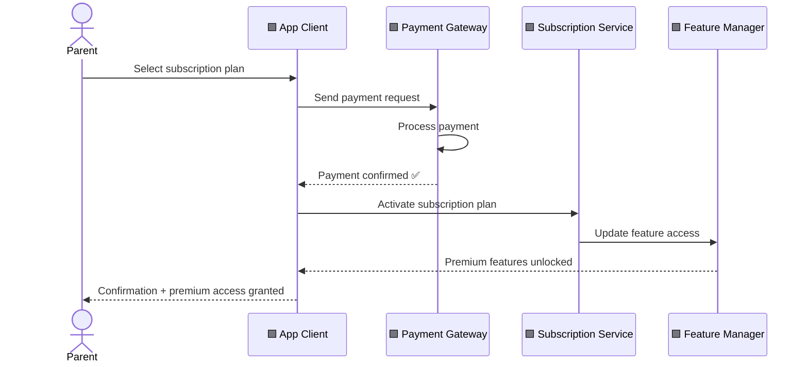

---

## MODULE 11 — Legal, COPPA / GDPR-K Compliance & Privacy

### 11.1 Use Case Diagram

```mermaid
graph LR
    subgraph Actors
        P(["👤 Parent"])
    end

    subgraph System ["🟩 System"]
        UC1["Provide Parental Consent"]
        UC2["Request Data Deletion"]
        UC3["Manage Privacy Settings"]
        UC4["Verify Age Compliance"]
        UC5["Store Consent Securely"]
        UC6["Maintain Audit Logs"]
        UC7["Encrypt Data"]
        UC8["Enforce Compliance Rules"]
    end

    P --> UC1
    P --> UC2
    P --> UC3
    UC1 --> UC4
    UC4 --> UC5
    UC5 --> UC6
    UC6 --> UC8
    UC7 --> UC8
```

### 11.2 System Sequence Diagram

```mermaid
sequenceDiagram
    actor Parent
    participant App as 🟩 App Client
    participant ComplianceSvc as 🟩 Compliance Service
    participant ConsentStore as 🟩 Consent Store
    participant AuditLog as 🟩 Audit Log

    Parent->>App: Create child account
    App->>ComplianceSvc: Check regulatory requirements\n(COPPA / GDPR-K)
    ComplianceSvc-->>App: Consent required

    App-->>Parent: Request parental consent
    Parent->>App: Provide consent

    App->>ConsentStore: Store consent securely\n(encrypted)
    ConsentStore-->>App: Stored ✅

    App->>AuditLog: Log consent action\n(timestamp, user, action)
    AuditLog-->>App: Logged ✅

    App->>App: Activate child account
    App->>ComplianceSvc: Register compliance rules\nfor this account
    ComplianceSvc-->>App: Rules enforced ✅
```

---

## MODULE 12 — DevOps, Deployment & AI Model Lifecycle

### 12.1 Use Case Diagram

```mermaid
graph LR
    subgraph Actors
        D(["🛠️ DevOps Engineer"])
    end

    subgraph EdgeAI ["🟦 Edge AI (SLM)"]
        EA1["Receive OTA Updates"]
        EA2["Install Model Update"]
    end

    subgraph CloudGPU ["🟧 Cloud GPU"]
        CG1["Run Updated Models"]
    end

    subgraph System ["🟩 System"]
        UC1["Deploy Models"]
        UC2["Roll Back Updates"]
        UC3["Monitor Infrastructure"]
        UC4["Package Model Update"]
        UC5["Distribute to Edge Devices"]
        UC6["Monitor Success / Failure"]
    end

    D --> UC1
    D --> UC2
    D --> UC3
    UC1 --> UC4
    UC4 --> UC5
    UC5 --> EA1
    EA1 --> EA2
    UC4 --> CG1
    UC5 --> UC6
    UC6 --> UC2
```

### 12.2 System Sequence Diagram

```mermaid
sequenceDiagram
    actor DevOps as 🛠️ DevOps Engineer
    participant CICD as 🟩 CI/CD Pipeline
    participant UpdateSvc as 🟩 Update Service
    participant EdgeDevice as 🟦 Edge Device (SLM)
    participant GPU as 🟧 Cloud GPU
    participant Monitor as 🟩 Monitoring Service

    DevOps->>CICD: Deploy new model version
    CICD->>UpdateSvc: Package model update

    par Edge Distribution
        UpdateSvc->>EdgeDevice: Push OTA update
        EdgeDevice->>EdgeDevice: Install new model
        EdgeDevice-->>Monitor: Report install result
    and Cloud GPU Update
        UpdateSvc->>GPU: Push updated model
        GPU->>GPU: Load & validate model
        GPU-->>Monitor: Report load result
    end

    Monitor->>Monitor: Evaluate success / failure

    alt Deployment successful
        Monitor-->>DevOps: ✅ Deployment confirmed
    else Deployment failed
        Monitor-->>DevOps: ❌ Failure detected
        DevOps->>CICD: Trigger rollback
        CICD->>UpdateSvc: Restore previous version
        UpdateSvc->>EdgeDevice: Rollback OTA
        UpdateSvc->>GPU: Rollback model
    end
```

---

## Boundary Summary

| Layer | Technology | Modules Involved |
|---|---|---|
| 🟦 **Edge AI (On-Device SLM)** | Lightweight language model (e.g., Phi-3, Gemma 2B) | 2, 3, 5, 6, 7, 12 |
| 🟧 **Cloud GPU (Self-Hosted)** | Diffusion model inference (e.g., SDXL, Flux) | 4, 12 |
| 🟩 **System / Backend** | App services, databases, APIs, sync, analytics | All modules |

> **Note**: All Edge AI operations occur fully on-device with no cloud round-trip. Cloud GPU is invoked only for media generation workloads (Module 4) and updated via DevOps pipelines (Module 12).
