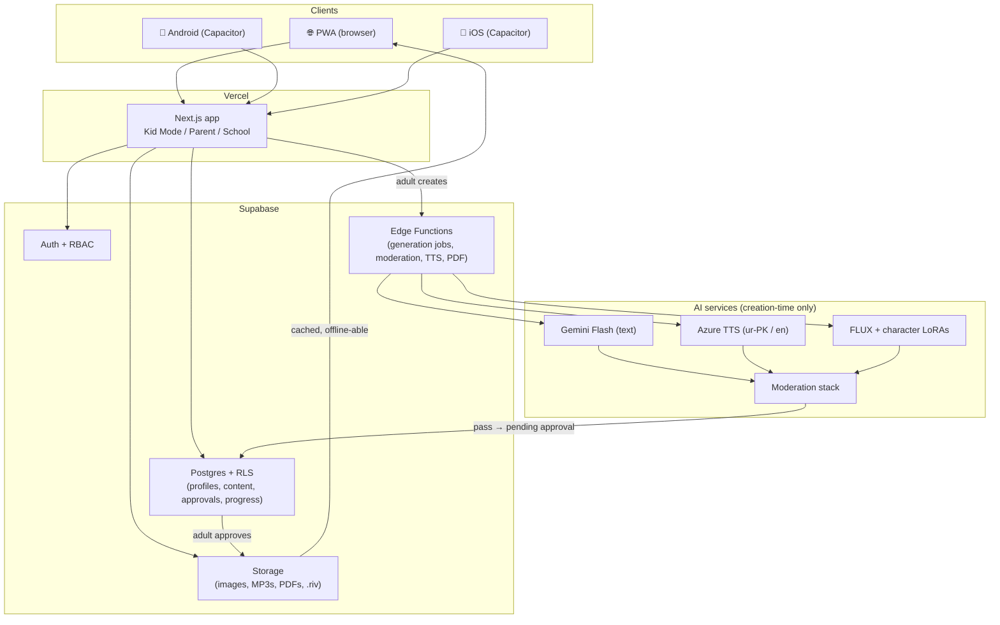

# 🦓 Zebra — Tech Stack & Architecture

> Part of the [Zebra Master Plan](../../README.md). Replaces the Flutter + on-device-SLM architecture (the old diagrams in `docs/architecture/` are kept for reference but superseded). Last updated: 2026-06-11.

## 0. Strategy in one paragraph

**Web-first, one codebase, boring proven tools, cloud AI behind a cache.** A responsive Next.js PWA is the product; Capacitor wraps the same app for Play Store and App Store. Supabase is the entire backend. AI generation happens server-side at *creation time* (parents/teachers), gets moderated and approved, then is served as static cached content to children — so the child experience is fast, offline-capable, and costs ~nothing per use.

## 1. The stack

| Layer | Choice | Why |
|---|---|---|
| Frontend framework | **Next.js (React) + TypeScript** | Best Claude Code velocity, biggest ecosystem, direct fit with Google Stitch output (HTML/Tailwind), SSR for the marketing/school pages, app router for the product |
| Styling / UI | **Tailwind CSS + shadcn/ui** (heavily themed for kids) | Stitch designs translate almost 1:1 to Tailwind; shadcn gives accessible primitives we restyle |
| Design ideation | **Google Stitch** → Figma → Tailwind components | Use Stitch to generate kid-UI concepts and the parent/teacher dashboards; treat its output as design reference + markup starter, not production code. Rebuild as typed React components. |
| State / data fetching | **Zustand + TanStack Query** | Light, simple, offline-friendly caching |
| i18n / RTL | **next-intl**, `dir="rtl"` per locale, **Noto Nastaliq Urdu** + a rounded Latin font | Urdu is first-class: logical CSS properties everywhere, every screen tested in both directions |
| Character animation | **Rive** (`@rive-app/react-canvas`) | Interactive state machines (idle/talk/celebrate), tiny files, same .riv asset on web/iOS/Android. Lottie acceptable for one-off decorations; Rive for the cast. |
| Coloring canvas | **HTML5 Canvas + pointer events** (Konva if needed) | Pointer events unify touch/stylus/mouse → tablets, touch laptops, phones all work |
| PWA / offline | **Serwist** service worker + IndexedDB (Dexie) for downloads | Library stories/audio cached for offline; critical for our market |
| Store apps | **Capacitor** (Android + iOS) wrapping the same build | One codebase. Add genuinely native value (offline downloads, haptics, splash, parental-gate biometrics) to clear Apple's guideline 4.2 "minimum functionality" bar — thin website wrappers get rejected; Capacitor apps with native capabilities routinely pass. |
| Backend | **Supabase** — Postgres + Row-Level Security, Auth, Storage, Edge Functions | Auth (incl. RBAC for parent/teacher/child-profile), database, file storage, and serverless functions in one free-tier-friendly service. RLS enforces "child profile can only read approved content" *in the database*, not just the UI. |
| Background jobs | **Supabase Edge Functions + pg_cron / queues** (Trigger.dev if outgrown) | Generation jobs, moderation pipeline, TTS rendering, PDF export |
| Hosting | **Vercel** (web) + Supabase cloud | Free tiers cover the pilot entirely |
| Analytics | **PostHog** (EU cloud, free tier) — parent/teacher surfaces only | No analytics SDK events from Kid Mode beyond anonymous, aggregated learning progress stored in our own DB |
| Payments | **Google Play Billing / Apple IAP** (apps) + **Safepay or JazzCash/Easypaisa** (web, Pakistan) + invoices for schools | Stripe doesn't operate in Pakistan; school B2B is invoice/bank-transfer anyway |
| Video assembly | **Remotion** (React-based programmatic video) on a render worker | "Motion stories" = images + TTS + captions + pans; looks like video, costs pennies |

## 2. AI services (creation-time only, always behind moderation)

| Task | Service | Notes & rough cost |
|---|---|---|
| Story/quiz/slide text | **Gemini 2.5 Flash-Lite / Flash** | Strong Urdu, ~free at our scale (fractions of a cent per story); generous AI Studio free tier for development. Claude API as the quality option for authoring the flagship library + the moderation-prompt second opinion. |
| Narration (TTS) | **Azure AI Speech** — `ur-PK-UzmaNeural` / `ur-PK-AsadNeural`, English neural voices | The reliable Urdu-Pakistan TTS. Free tier 0.5M chars/month, then ~$15–16/1M chars (~$0.08 per story). Generated once per story, cached forever. ElevenLabs = optional premium English voices later. |
| Illustrations / comics / coloring line art | **FLUX (schnell/dev) via fal.ai or Replicate** + per-character LoRAs | ~$0.003–0.04 per image. LoRA training ~$2–5 one-time per character keeps the cast on-model. Gemini image (Nano Banana, ~$0.04/img) as fallback for instruction-heavy edits. |
| Text moderation | **OpenAI Moderation API (free)** + our own rule layer + LLM safety-judge pass | Three cheap layers, see [04-safety-and-compliance.md](04-safety-and-compliance.md) |
| Image moderation | **Google Cloud Vision SafeSearch** (first 1K/month free, then ~$1.50/1K) or Azure AI Content Safety | Every generated image, no exceptions |
| Real AI video | **Deferred (P2)** — Veo/Kling class only for batch flagship content | $0.10–0.50+/second makes per-user video generation economically impossible; Remotion motion-stories deliver 80% of the value at ~0% of the cost |

**Future cost optimization (P2, from the old plan, kept):** move bulk text generation to a self-hosted small model or on-device WebLLM once volume justifies it. Not for the MVP — low-end devices and a one-week timeline rule it out.

## 3. System shape



**The golden path:** adult prompt → Edge Function job → AI generation → automated moderation → `status: pending_review` → adult approves → `status: published(profile|class|library)` → child sees it. RLS guarantees children can only ever `SELECT` published rows.

## 4. Repo structure (proposed)

```
zebra/
  apps/web/            # Next.js app (kid mode, parent, school, marketing)
  apps/mobile/         # Capacitor shell (config + native plugins only)
  packages/ui/         # design system (themed shadcn, Rive wrappers)
  packages/content/    # word lists, question banks, story schemas (JSON + zod)
  packages/ai/         # generation + moderation pipelines (server-only)
  supabase/            # migrations, RLS policies, edge functions
  docs/                # these plans, brand/style guide, architecture
  legacy/flutter-app/  # ← move the old app/ here (or delete) — superseded
```

## 5. Frontend design workflow with Google Stitch

1. Prompt Stitch with the brand brief (characters, palette, "chunky rounded kid UI, Urdu RTL variant") per screen — Kid home, story reader, spelling game, parent dashboard, teacher presentation maker.
2. Export to Figma, pick the winners, tighten spacing/contrast (kid UI needs ≥48px touch targets, AAA-ish contrast).
3. Hand screenshots + exported markup to Claude Code as the spec; implement as typed components in `packages/ui` with Tailwind tokens (`--zebra-*` palette).
4. Every component built twice-tested: LTR English and RTL Urdu.

## 6. Answers to open questions

- **"Which tool for character animation?" → Rive** for everything in-app (free tier, native runtimes everywhere, interactive). Blender Grease Pencil (free) when we start producing longer video episodes. Spine only if we ever go game-engine.
- **"Google Stitch for frontend?"** → Yes, as the design/ideation layer feeding a Next.js + Tailwind implementation. Don't ship Stitch output directly.
- **"Scrap Flutter?"** → Done. Web-first Next.js + Capacitor replaces it; `app/` to be archived to `legacy/` (one decision pending: archive vs delete).
