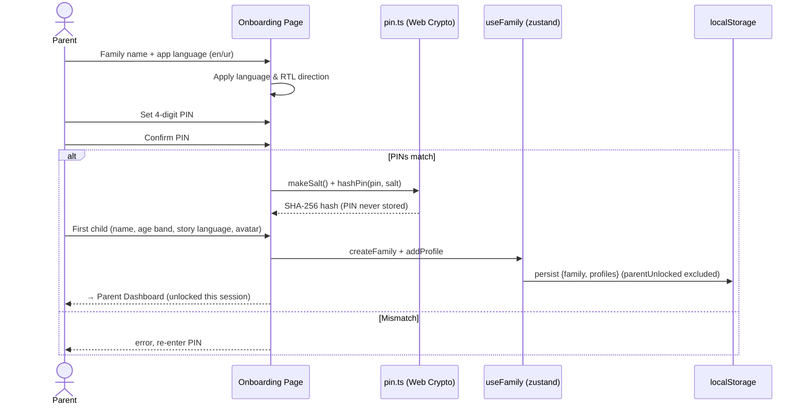
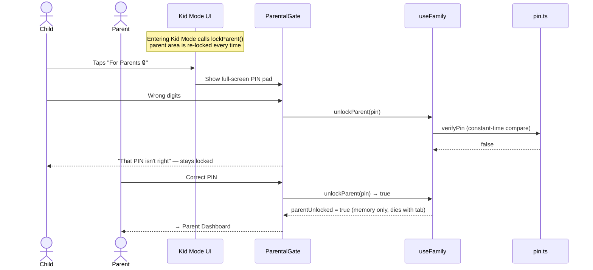
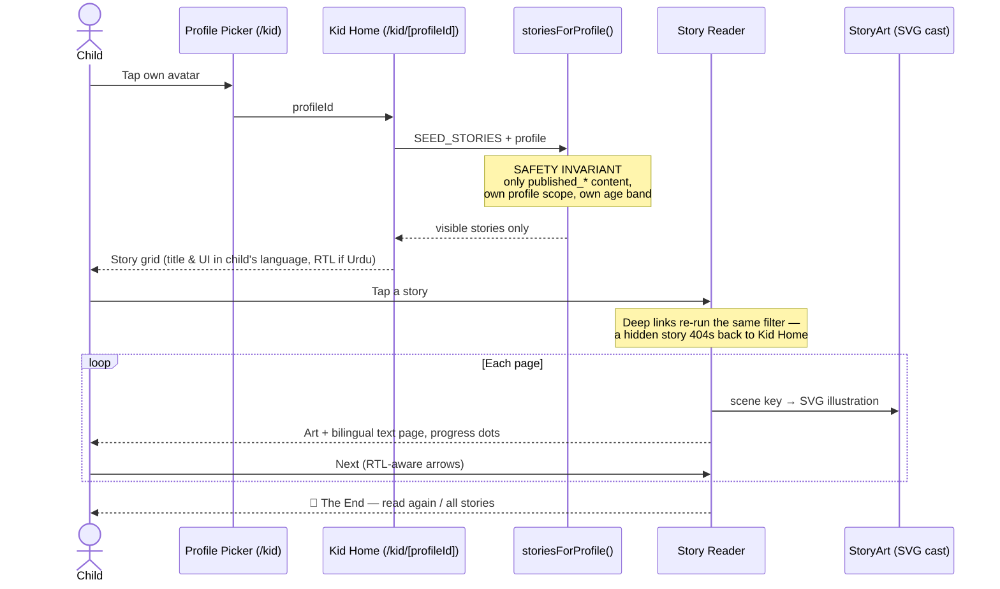

# 🦓 Sprint 1 — Sequence Diagrams (as implemented)

> These diagrams describe code that exists and runs today, not aspirations.
> Sprint report: [sprint-01-foundation.md](sprint-01-foundation.md)

## 1. Onboarding — family, PIN, first child



## 2. Parental gate — the only door out of Kid Mode



## 3. Child reads a story — every path crosses the safety filter



## 4. Where this architecture is headed (sprint 2–3 seams, already in place)

```mermaid
sequenceDiagram
    participant Store as useFamily / content store
    participant Local as localStorage adapter (today)
    participant SB as Supabase (sprint 2)
    participant RLS as RLS + approval trigger (0001_init.sql — written)

    Note over Store: Pages talk only to store actions
    Store->>Local: today: persist/read
    Store-->>SB: sprint 2: same actions, cloud adapter
    SB->>RLS: every child read
    Note over RLS: kid JWT can only SELECT published rows;<br/>trigger refuses publish without<br/>approver + moderation verdict
```
