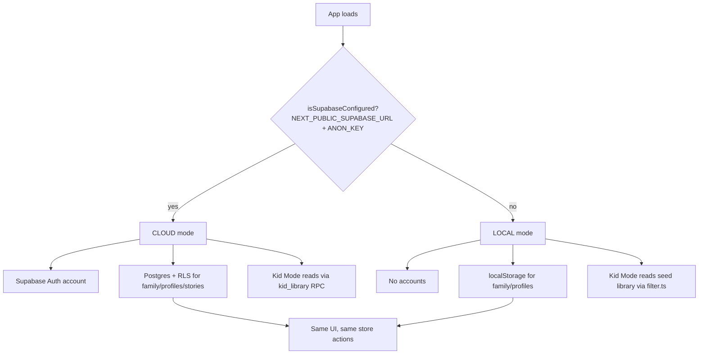
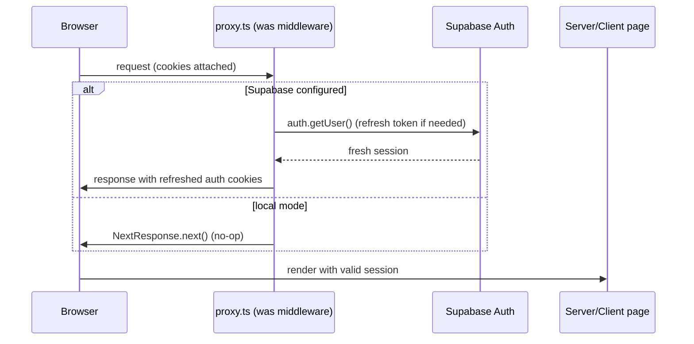
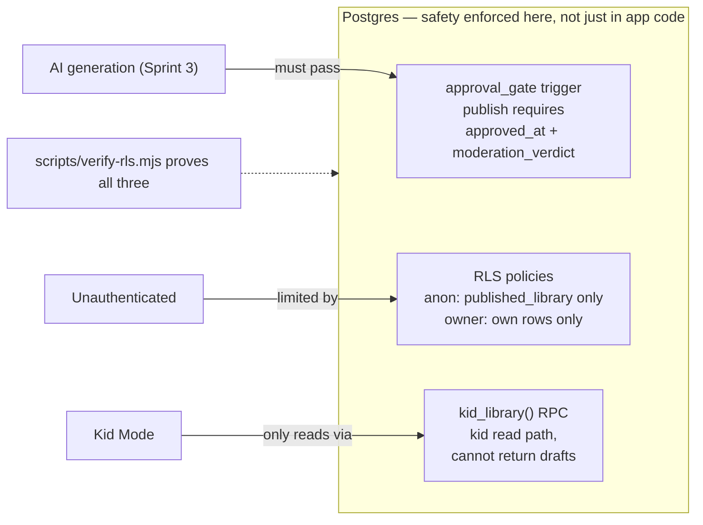

# 🦓 Sprint 2 — Sequence Diagrams (as implemented)

> Code that exists and runs today. Sprint report: [sprint-02-supabase.md](sprint-02-supabase.md)

## 1. Mode selection — one codebase, two backends



## 2. Cloud onboarding — account → family → child

```mermaid
sequenceDiagram
    actor Parent
    participant UI as Onboarding
    participant Store as useFamily
    participant Auth as Supabase Auth
    participant DB as Postgres (RLS)

    Parent->>UI: Email + password
    UI->>Store: signUp(email, password)
    Store->>Auth: auth.signUp
    alt Email confirmation OFF (recommended for dev)
        Auth-->>Store: session created
        Parent->>UI: Family name + 4-digit PIN (hashed client-side)
        UI->>Store: createFamily(name, pin)
        Store->>DB: insert families (owner = auth.uid())
        Note over DB: RLS check: owner = auth.uid() ✅
        Parent->>UI: First child (name, age band, language)
        UI->>Store: addProfile(...)
        Store->>DB: insert child_profiles (family_id of owner)
        UI-->>Parent: → Parent Dashboard
    else Email confirmation ON
        Auth-->>Store: no session yet
        Store-->>UI: hasSession = false
        UI-->>Parent: "Check your email, then sign in"
    end
```



## 3. Session refresh via the Next 16 proxy



## 4. Kid Mode read — DB-enforced safety boundary

```mermaid
sequenceDiagram
    actor Child
    participant Kid as Kid Home / Reader
    participant Lib as loadKidStories()
    participant RPC as kid_library(profile_id)
    participant DB as Postgres

    Child->>Kid: Open profile / story
    Kid->>Lib: loadKidStories(profile)
    Note over Lib: cloud mode → RPC; local mode → filter.ts
    Lib->>RPC: rpc('kid_library', { p_profile_id })
    RPC->>DB: join profile→family, check f.owner = auth.uid()
    Note over DB,RPC: SECURITY DEFINER returns ONLY<br/>published_library + published_profile(own)<br/>matching the profile's age band.<br/>A draft CANNOT be returned.
    DB-->>RPC: published rows only
    RPC-->>Kid: safe stories
    Kid-->>Child: library / reader
```

## 5. The three database-level safety guarantees


