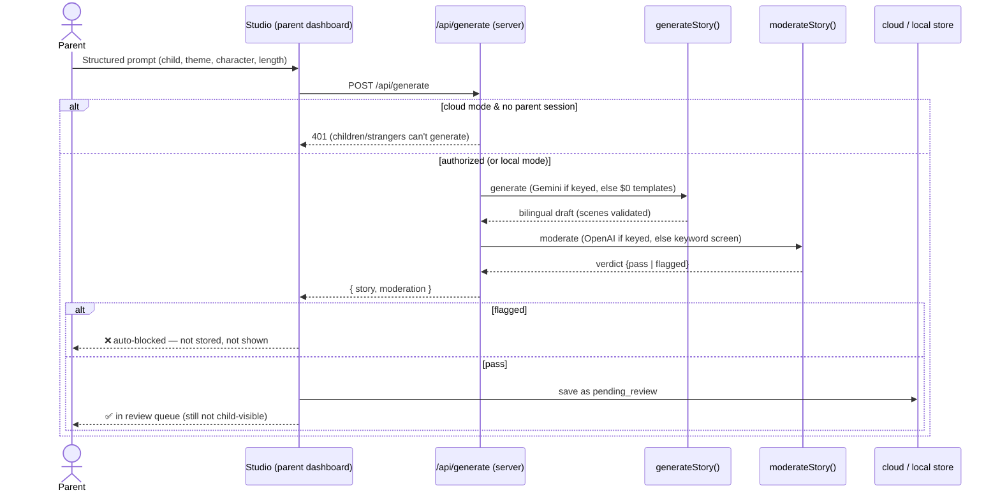
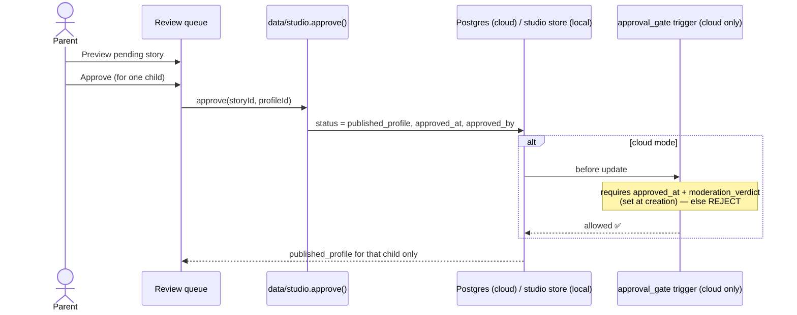
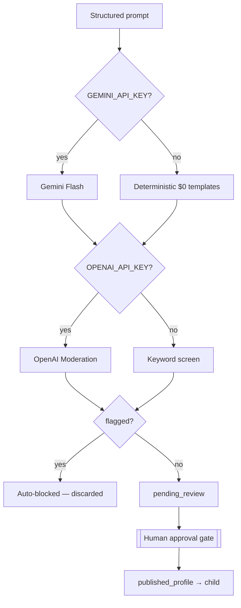
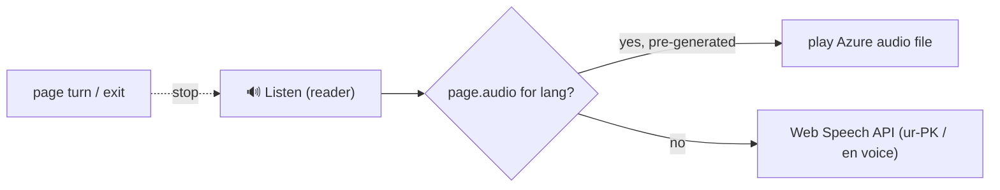
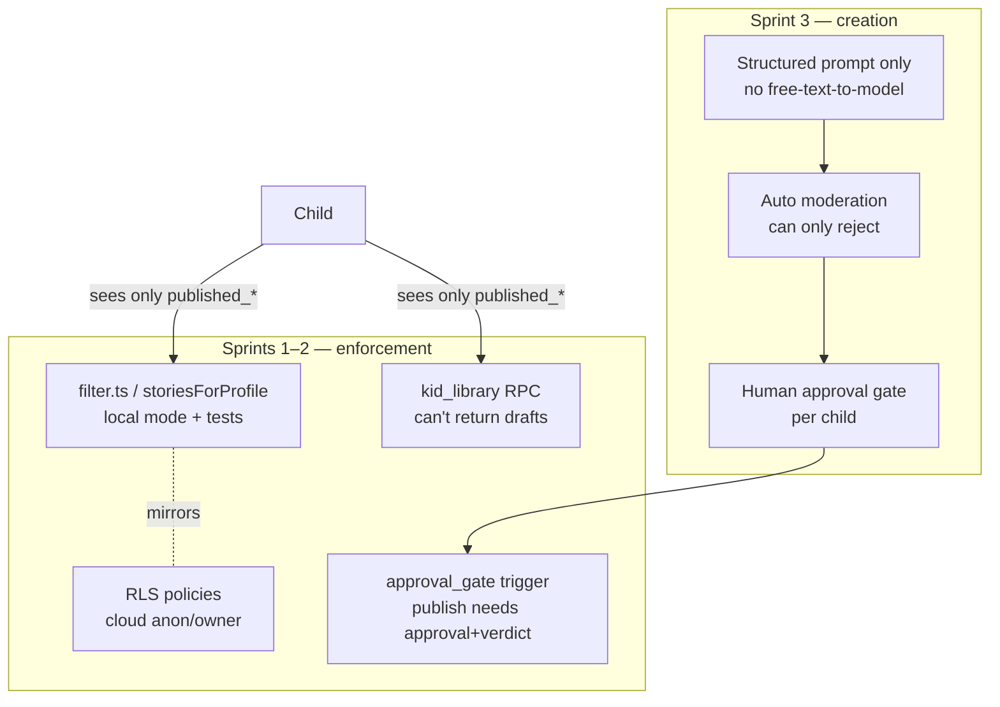

# 🦓 Sprint 3 — Sequence Diagrams (as implemented)

> Code that exists and runs today. Sprint report: [sprint-03-generation.md](sprint-03-generation.md)

## 1. The creation pipeline — generate → moderate → review → approve

## 2. The human approval gate — the only path to a child

## 3. Two backends, one provider-fallback switch

## 4. Read-along narration — $0 now, Azure-ready

## 5. Where the safety invariant is enforced (cumulative, Sprints 1–3)

