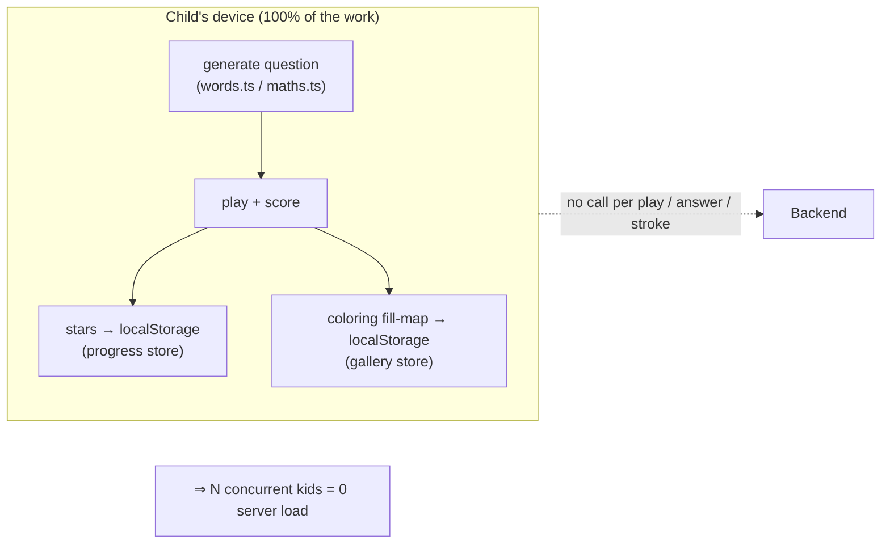
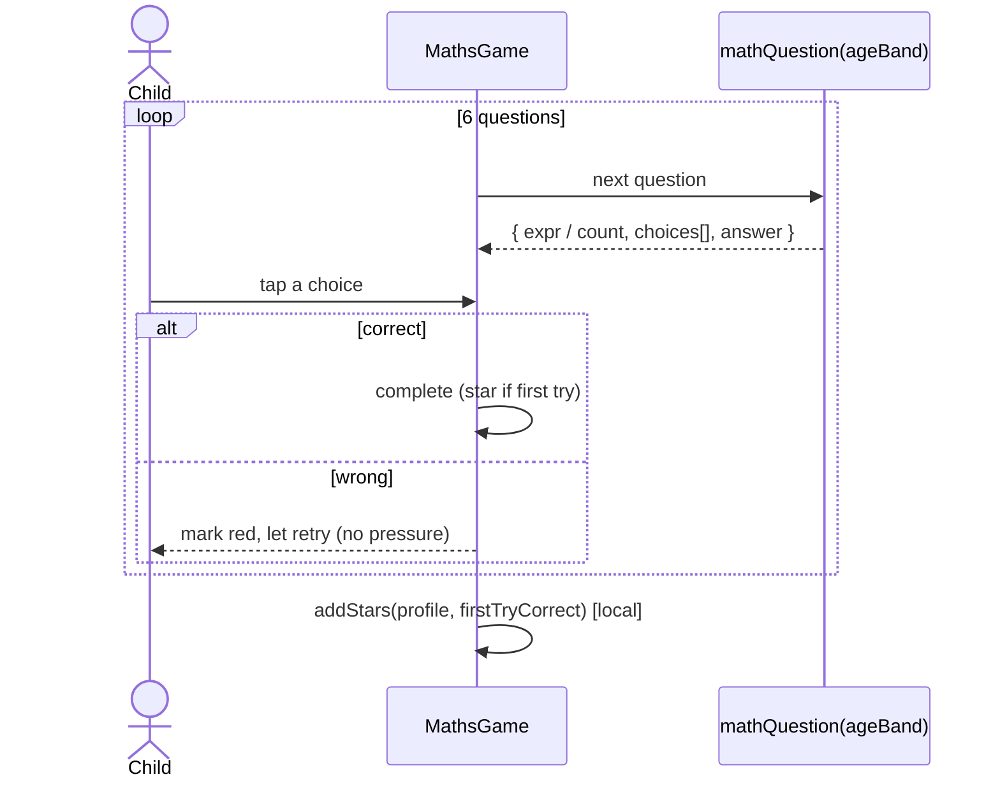
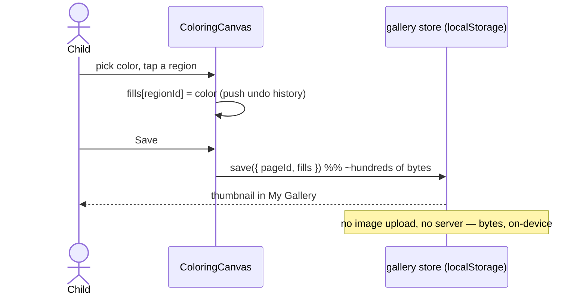
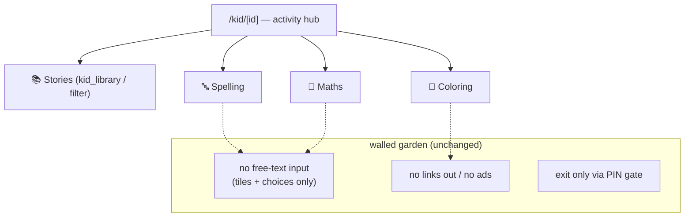

# 🦓 Sprint 4 — Sequence Diagrams (as implemented)

> Code that exists and runs today. Sprint report: [sprint-04-games-coloring.md](sprint-04-games-coloring.md)

## 1. Why it scales — the games never touch the server



## 2. Spelling round (bilingual, Urdu-joining-safe)

```mermaid
sequenceDiagram
    actor Child
    participant Game as SpellingGame
    participant Words as spellingRound()
    participant TTS as SpeakButton (Web Speech)

    Game->>Words: spellingRound(ageBand, lang, 5)
    Words-->>Game: shuffled word items
    loop each word
        Game->>TTS: hear the word (optional)
        Child->>Game: tap a letter tile
        alt matches targetChars[filled]
            Game->>Game: filled++ ; render target.slice(0, filled)
            Note over Game: Urdu prefix is a REAL substring → joins correctly
        else wrong
            Game->>Game: flash tile, count a miss (no star if missed)
        end
        Game-->>Child: word complete → Next
    end
    Game->>Game: addStars(profile, cleanWords) [local]
```

## 3. Maths drill (age-banded, multiple-choice)



## 4. Coloring + gallery (saves a fill-map, not an image)



## 5. Kid Mode hub (where the safety rules still hold)


