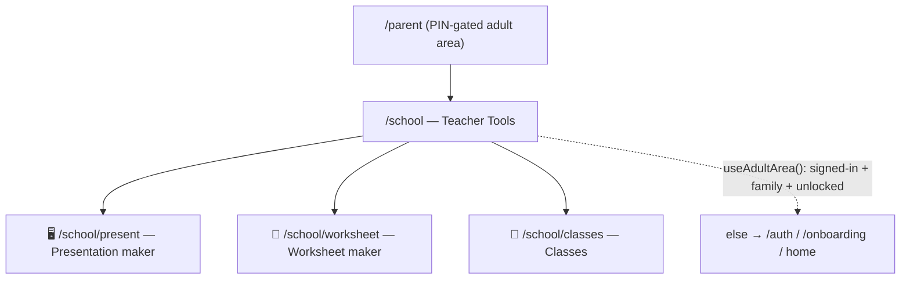
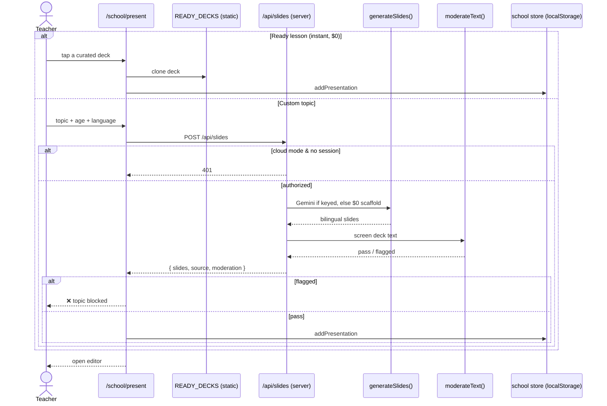
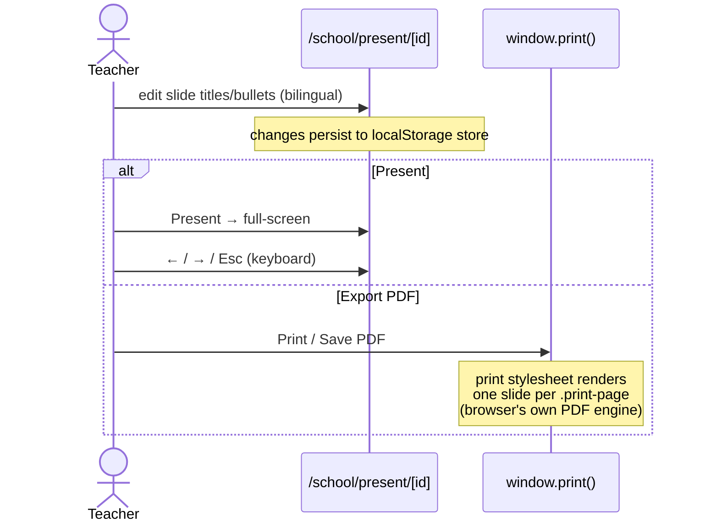
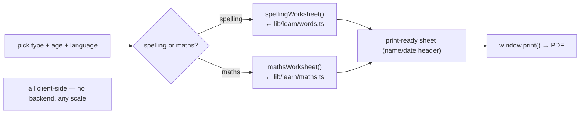
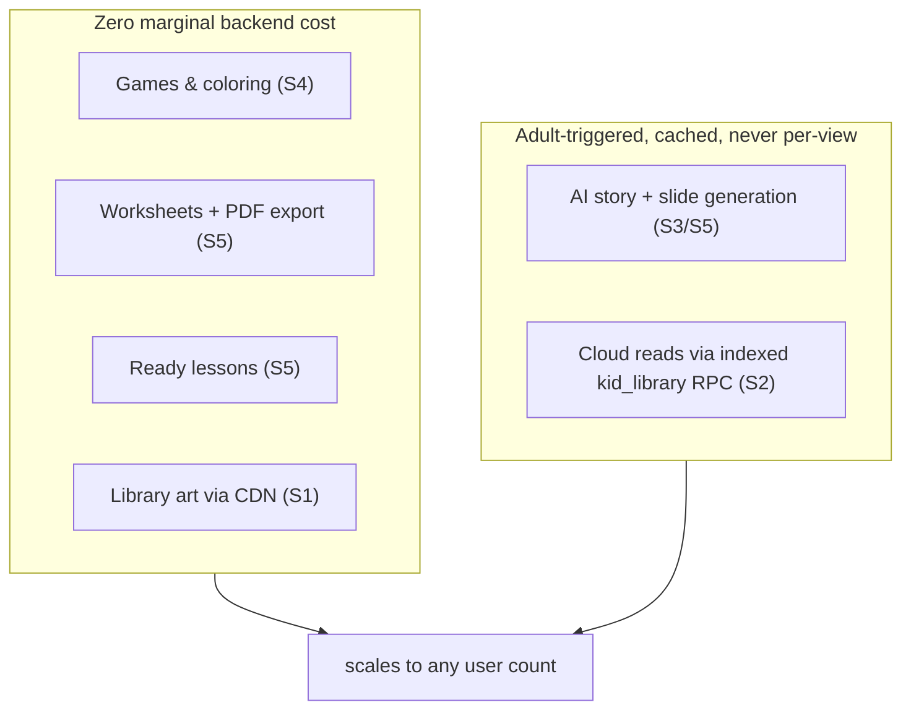

# 🦓 Sprint 5 — Sequence Diagrams (as implemented)

> Code that exists and runs today. Sprint report: [sprint-05-school-workspace.md](sprint-05-school-workspace.md)

## 1. Teacher Tools — entry and layout

## 2. Make a presentation (two paths, both cheap)

## 3. Present & export (zero server cost)

## 4. Worksheets reuse the game engines

## 5. Scalability map (cumulative, Sprints 1–5)

